# 🧠 Orca - Code Review Knowledge Graph & Context Design Specification

This document provides a comprehensive structural code analysis and knowledge graph breakdown for the Orca codebase. Built using AST-based parsing (Tree-sitter) and graph analysis tools (`code-review-graph`), this model indexes calls, dependencies, control flows, hub nodes, architectural communities, and execution paths.

---

## 📊 Knowledge Graph Summary Statistics

| Metric | Count / Value | Description |
| :--- | :--- | :--- |
| **Total Files Parsed** | `19` | All Python source modules across routes, services, schemas, and prompts |
| **Total Nodes** | `43` | Functions, methods, routes, module imports, and external handlers |
| **Total Edges** | `301` | Call relationships, module imports, instantiation edges |
| **Communities** | `4` | Cohesive architectural clusters derived via modularity resolution |
| **Execution Flows** | `8` | End-to-end execution paths from API entry points to tool execution |
| **Build Status** | `OK` | Head commit `cbb7b2dddebba` on branch `backend-latest` |

---

## 🏛️ Architectural Communities

The Orca codebase is partitioned into 4 distinct architectural communities based on directional call density and module cohesion:

```mermaid
graph TB
    subgraph Community_1 ["Community 1: routes-agent (3 nodes)"]
        R_Agent["routes/agent.py::agent"]
        R_Auth["routes/auth.py::authenticator"]
        R_Speech["routes/speech.py::speech"]
    end

    subgraph Community_2 ["Community 2: internal-tools-fetch (2 nodes)"]
        R_EEZ["routes/internal_tools/eez_boundaries.py::fetch_eez_boundaries"]
        R_PFZ["routes/internal_tools/pfz.py::fetch_pfz"]
    end

    subgraph Community_3 ["Community 3: services-call (9 nodes - Core Reasoning)"]
        S_Agent["services/agent_service.py::call_agent"]
        S_Orch["services/orchestrator.py::call_orchestrator"]
        S_Auth["services/auth_service.py::handle_auth"]
        S_DB["services/db_connection_service.py::connect_to_db"]
        S_DBConn["services/db_connection_service.py::_connect"]
        S_Ext["services/extract_tool.py::extract_json_between_tags"]
        S_Trans["services/orchestrator.py::sync_translate"]
        S_STT["services/stt_sarvam.py::stt"]
        S_SDK["services/stt_sarvam.py::call_sarvam_sdk"]
    end

    subgraph Community_4 ["Community 4: internal-tools-pfz (8 nodes - Domain Tools)"]
        T_EEZ["services/internal_tools/eez_boundaries_service.py::get_eez_boundaries"]
        T_MetAgent["services/internal_tools/execute_meteorology_agent.py::call_meteorology_agent"]
        T_SpatAgent["services/internal_tools/execute_spatial_agent.py::call_spatial_agent"]
        T_Meteo["services/internal_tools/open_meteo.py::get_marine_weather_forecast"]
        T_MeteoSync["services/internal_tools/open_meteo.py::sync_fetch"]
        T_PFZ["services/internal_tools/pfz_service.py::get_pfz"]
        T_PFZLoc["services/internal_tools/pfz_service.py::get_pfz_by_location"]
        T_PFZSync["services/internal_tools/pfz_service.py::_scrape_pfz_sync"]
    end

    %% Cross-Community Dependencies
    R_Agent -->|CALLS| S_Orch
    R_Auth -->|CALLS| S_Auth
    R_Speech -->|CALLS| S_STT
    R_EEZ -->|CALLS| T_EEZ
    R_PFZ -->|CALLS| T_PFZ
    T_EEZ -->|CALLS| S_DB
    T_MetAgent -->|CALLS| S_Agent
    T_SpatAgent -->|CALLS| S_Agent
```



### Community Details

1. **`services-call` (Community ID: 7)**:
   - **Size**: 9 functions/methods
   - **Role**: Core reasoning engine, general agent loop, orchestrator logic, tag parsing (`extract_json_between_tags`), database connection factory (`_connect`, `connect_to_db`), and Sarvam AI integration.
2. **`internal-tools-pfz` (Community ID: 8)**:
   - **Size**: 8 functions/methods
   - **Role**: Domain-specific AI tools including Open-Meteo marine forecasting (`sync_fetch`, `get_marine_weather_forecast`), web scraping for Potential Fishing Zones (`_scrape_pfz_sync`), PostGIS EEZ boundaries lookup, and sub-agent dispatchers (`call_meteorology_agent`, `call_spatial_agent`).
3. **`routes-agent` (Community ID: 5)**:
   - **Size**: 3 API endpoints
   - **Role**: High-level HTTP controllers for agent interaction (`/agent`), speech transcription (`/speech`), and authentication (`/auth`).
4. **`internal-tools-fetch` (Community ID: 6)**:
   - **Size**: 2 API endpoints
   - **Role**: REST controllers exposing direct access to domain capabilities (`/internal_tools/eez_boundaries`, `/internal_tools/pfz`).

---

## 🔄 Execution Flows & Control Paths

Orca contains **8 primary execution flows**. Each flow represents a deterministic path through the application stack.

| Flow ID | Flow Name | Entry Point | Depth | Node Count | Criticality Score | Description / Call Path |
| :--- | :--- | :--- | :---: | :---: | :---: | :--- |
| **`flow-1`** | `fetch_eez_boundaries` | `routes/internal_tools/eez_boundaries.py` | `2` | `3` | `0.603` | `fetch_eez_boundaries()` → `get_eez_boundaries()` → `connect_to_db()` |
| **`flow-2`** | `call_meteorology_agent` | `services/internal_tools/execute_meteorology_agent.py` | `2` | `3` | `0.603` | `call_meteorology_agent()` → `call_agent()` → `get_marine_weather_forecast()` |
| **`flow-3`** | `call_spatial_agent` | `services/internal_tools/execute_spatial_agent.py` | `2` | `3` | `0.603` | `call_spatial_agent()` → `call_agent()` → `get_pfz_by_location()` |
| **`flow-4`** | `agent` | `routes/agent.py::agent` | `2` | `3` | `0.520` | `agent()` → `call_orchestrator()` → `call_agent()` |
| **`flow-5`** | `authenticator` | `routes/auth.py::authenticator` | `1` | `2` | `0.485` | `authenticator()` → `handle_auth()` |
| **`flow-6`** | `speech` | `routes/speech.py::speech` | `1` | `2` | `0.435` | `speech()` → `stt()` |
| **`flow-7`** | `fetch_pfz` | `routes/internal_tools/pfz.py` | `1` | `2` | `0.315` | `fetch_pfz()` → `get_pfz()` |
| **`flow-8`** | `get_pfz_by_location` | `services/internal_tools/pfz_service.py` | `1` | `2` | `0.240` | `get_pfz_by_location()` → `get_pfz()` |

---

## 🎯 Centrality Analysis: Hub & Bridge Nodes

### Top Hub Nodes (Highest Connectivity Degree)
Hub nodes represent functions with high fan-in or fan-out. Modifications to these nodes have a high **blast radius**.

1. 🌟 **`services/agent_service.py::call_agent`** (Degree: 36, In: 3, Out: 33)
   - *Role*: The central async generator loop driving LLM reasoning, XML tag extraction (`<thought>`, `<tool_call>`, `<final>`), sub-agent recursive execution, and SSE event streaming.
2. 🧠 **`services/orchestrator.py::call_orchestrator`** (Degree: 34, In: 2, Out: 32)
   - *Role*: The master orchestrator injecting user geolocation and delegating tasks to meteorology and spatial sub-agents.
3. ⚙️ **`services/internal_tools/pfz_service.py::_scrape_pfz_sync`** (Degree: 19, In: 2, Out: 17)
   - *Role*: Synchronous web-scraping worker that fetches real-time PFZ advisories from government/maritime bulletins.
4. 🌊 **`services/internal_tools/open_meteo.py::sync_fetch`** (Degree: 11, In: 1, Out: 10)
   - *Role*: Open-Meteo HTTP worker fetching oceanographic weather metrics (wave height, wave direction, ocean currents, sea surface temperature).

### Top Bridge Nodes (Highest Architectural Betweenness)
Bridge nodes link separate communities together. Changes to bridge nodes can disrupt cross-module communication.

1. 🌉 **`services/internal_tools/pfz_service.py::_scrape_pfz_sync`** (Betweenness: 0.005448)
2. 🌉 **`services/agent_service.py::call_agent`** (Betweenness: 0.004093)
3. 🌉 **`services/orchestrator.py::call_orchestrator`** (Betweenness: 0.004046)
4. 🌉 **`services/internal_tools/pfz_service.py::get_pfz`** (Betweenness: 0.002842)
5. 🌉 **`services/internal_tools/open_meteo.py::sync_fetch`** (Betweenness: 0.001429)

---

## 🛡️ Code Review Guidelines & Blast Radius Protocol

When reviewing or submitting pull requests for Orca, follow this protocol using the `code-review-graph` MCP server:

### Step 1: Incremental Graph Update
Before reviewing a branch or PR, sync the graph:
```json
{
  "ServerName": "code-review-graph",
  "ToolName": "build_or_update_graph_tool",
  "Arguments": { "full_rebuild": false }
}
```

### Step 2: Check Blast Radius for Modified Files
To assess the impact radius of changes made to `agent_service.py` or `orchestrator.py`:
```json
{
  "ServerName": "code-review-graph",
  "ToolName": "get_impact_radius_tool",
  "Arguments": { "node_id": "C:/Users/ASUS/Documents/GitHub/Orca/services/agent_service.py::call_agent" }
}
```

### Step 3: Check Affected Execution Flows
Determine which user-facing API flows are affected by your pull request:
```json
{
  "ServerName": "code-review-graph",
  "ToolName": "get_affected_flows_tool",
  "Arguments": { "changed_files": ["services/agent_service.py"] }
}
```

---

## 📚 Related Documentation & Generated Wiki Pages

- 📖 **Main Project README**: [`README.md`](README.md)
- 🌐 **Auto-generated Wiki Index**: [`.code-review-graph/wiki/index.md`](.code-review-graph/wiki/index.md)
  - 📄 [Wiki Page: `services-call`](.code-review-graph/wiki/services-call.md)
  - 📄 [Wiki Page: `internal-tools-pfz`](.code-review-graph/wiki/internal-tools-pfz.md)
  - 📄 [Wiki Page: `routes-agent`](.code-review-graph/wiki/routes-agent.md)
  - 📄 [Wiki Page: `internal-tools-fetch`](.code-review-graph/wiki/internal-tools-fetch.md)
