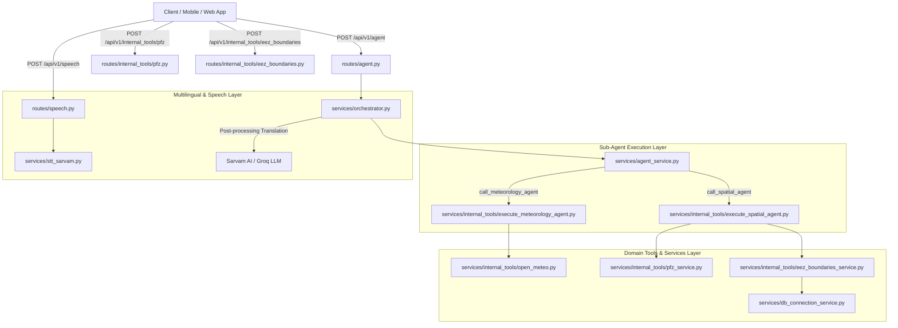

# 🐋 Orca - Maritime Intelligence & Agentic Spatial-Meteorological System

Orca is an agentic, AI-powered maritime intelligence backend designed to assist fishermen, marine navigators, and coastal authorities. By combining real-time marine weather forecasting, Potential Fishing Zone (PFZ) intelligence, Exclusive Economic Zone (EEZ) spatial boundaries, multilingual speech-to-text, and real-time translation, Orca delivers actionable insights directly to users in their native language.

---

## 📐 Architecture Overview

Orca uses a **Hierarchical Multi-Agent Architecture** powered by `FastAPI`, `LangChain`, `ChatGroq` (`gpt-oss-120b`), and `Sarvam AI`. 



---

## 🛠️ Key Components & Directory Structure

```
Orca/
├── main.py                     # FastAPI entry point & API Router setup
├── pyproject.toml              # Dependencies & project configuration
├── schema/                     # Request and Response Pydantic models
│   └── chat_model.py           # ChatRequest schema (lat, long, prompt, role, lang)
├── routes/                     # REST & SSE API Route controllers
│   ├── agent.py                # Streaming agent endpoint
│   ├── speech.py               # Speech-to-text audio endpoint
│   ├── auth.py                 # Authentication handler
│   └── internal_tools/         # Direct tool exposure endpoints
│       ├── eez_boundaries.py
│       └── pfz.py
├── services/                   # Core application business logic
│   ├── agent_service.py        # Generic XML tool-calling agent loop
│   ├── orchestrator.py         # Main multi-agent orchestrator & translation
│   ├── stt_sarvam.py           # Sarvam AI speech-to-text integration
│   ├── db_connection_service.py# PostgreSQL DB connection manager
│   ├── extract_tool.py         # JSON-in-XML parser helper
│   └── internal_tools/         # Sub-agents and tool implementations
│       ├── execute_meteorology_agent.py
│       ├── execute_spatial_agent.py
│       ├── open_meteo.py       # Open-Meteo Marine Weather API
│       ├── pfz_service.py      # Potential Fishing Zone scraper & lookup
│       └── eez_boundaries_service.py # PostGIS EEZ boundaries lookup
├── prompts/                    # Multi-agent prompt templates
│   └── system_prompts.py       # System prompts for Orchestrator, Spatial & Meteorology agents
├── Datasets/                   # Marine & oceanographic data stores (Argo profiles, DBs)
└── .code-review-graph/         # Structural Code Knowledge Graph & Auto-generated Wiki
```

---

## ⚡ Quick Start & Setup

### 1. Prerequisites
- **Python 3.10+** (managed via `uv` or `venv`)
- **PostgreSQL** with PostGIS extension (for EEZ spatial queries)
- **API Keys**:
  - `GROQ_API_KEY`: For Groq LLM reasoning (`openai/gpt-oss-120b`)
  - `SARVAM_API_KEY`: For multilingual speech-to-text and translation

### 2. Environment Configuration
Create a `.env` file in the root directory:

```env
GROQ_API_KEY=your_groq_api_key
SARVAM_API_KEY=your_sarvam_api_key
DB_USER=your_db_user
DB_PASSWORD=your_db_password
DB_HOST=localhost
DB_PORT=5432
DB_NAME=orca_db
```

### 3. Install Dependencies & Run
Using `uv`:
```bash
uv sync
uv run uvicorn main:app --reload --port 8000
```

Or using `pip`:
```bash
pip install -r pyproject.toml
uvicorn main:app --reload --port 8000
```

---

## 🔍 Code Review Knowledge Graph & Analysis

Orca is indexed with a **Code Review Knowledge Graph** powered by `code-review-graph`. This allows token-efficient, structural context analysis, flow tracing, community detection, and architectural impact reviews.

- **Graph Specification & Topological Analysis**: See [`CODE_REVIEW_GRAPH.md`](CODE_REVIEW_GRAPH.md)
- **Auto-Generated Code Wiki**: Explore [`.code-review-graph/wiki/index.md`](.code-review-graph/wiki/index.md)
- **Graph Metrics**:
  - **Parsed Files**: 19 Python modules
  - **Structural Nodes**: 41 (Functions, Methods, Imports, Modules)
  - **Structural Edges**: 261 (Calls, Imports, Instantiations)
  - **Architectural Communities**: 4 decoupled modules
  - **Execution Flows**: 8 entry-point execution paths

### Querying the Code Graph via MCP

Developers and AI reviewers can query the graph directly:
- **Build / Sync Graph**: `build_or_update_graph_tool()`
- **Get Architecture Overview**: `get_architecture_overview_tool()`
- **List Execution Flows**: `list_flows_tool()`
- **Check Hub Nodes**: `get_hub_nodes_tool()`
- **Check Bridge Nodes**: `get_bridge_nodes_tool()`

---

## 📄 Documentation Index

- [`CODE_REVIEW_GRAPH.md`](CODE_REVIEW_GRAPH.md): Comprehensive Knowledge Graph & Architectural Impact Guide
- [`services/README.md`](services/README.md): Services & Agent Reasoning Loop Documentation
- [`services/internal_tools/README.md`](services/internal_tools/README.md): Meteorological & Spatial Tools Documentation
- [`routes/README.md`](routes/README.md): REST & SSE API Specification
- [`prompts/README.md`](prompts/README.md): System Prompts & Multi-Agent Instruction Rules
- [`schema/README.md`](schema/README.md): Data Contracts & Pydantic Schemas
